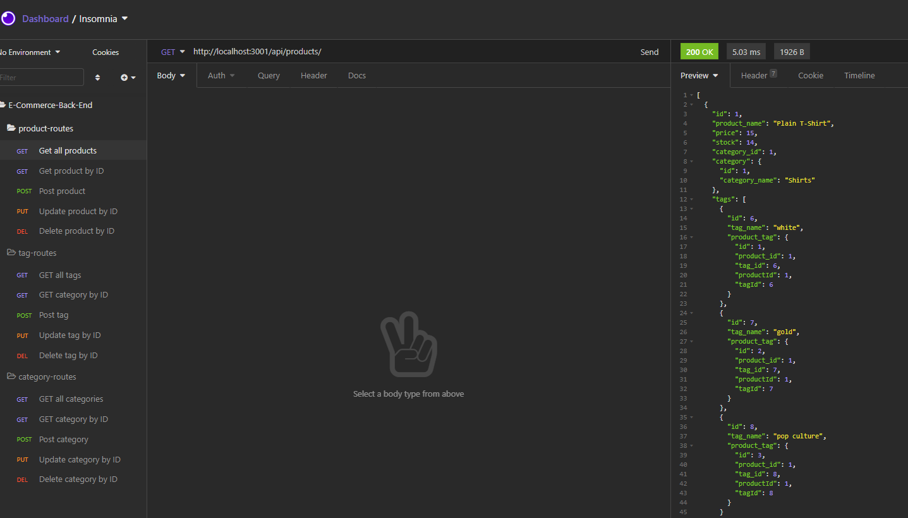

# E Commerce Backend Ha

Utilises database information to serve content to users.
Complete server side coding to respond to user’s request and interact with the SQL database.

# Table of Contents
  * [Licence](#Licence)
  * [Youtube Demo](#Youtube_Demo)
  * [GitHub Site](#GitHub_Site)
  * [ScreenShot](#ScreenShot)
  * [Technology Used](#Technology_Used)
  * [Usage](#Usage)
  * [Questions](#Questions)

# Licence
No Licence.

# Youtube_Demo
https://youtu.be/ivZtOIeZREA

# GitHub_Site
https://github.com/RichoHa/eCommerceBackEndHa

# ScreenShot

# Technology_Used
-   dotenv https://www.npmjs.com/package/dotenv
-   Mysql2 https://www.npmjs.com/package/mysql2
-   express https://developer.mozilla.org/en-US/docs/Learn/Server-side/Express_Nodejs
-   sequelize https://www.npmjs.com/package/sequelize

# Usage
- fill out ".env" file and rename to just.env in develop file.
- npm install at root directory in develop file.
- go to the DB/SQL file and create database.
- To SEED: from the develop file "node seeds/index"
- To START: from the develop file "node sever"
- Check the routes file for all the requests that you can make or cheeck my video.

# Questions
 If you have any queries, please email me on Richard.dqh@gmail.comS